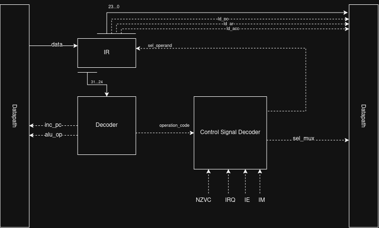

# Лабораторная работа №4

ФИО: Ровкова Анастасия Сергеевна

Группа: P3216

Вариант:

```text
forth | acc | neum | hw | tick | binary | trap | port | cstr | prob2
```

Усложнение `superscalar` не используется.

## Структура проекта

| Путь | Назначение |
| ---- | ---------- |
| [`cmd/translator`](cmd/translator) | консольный транслятор Forth-кода в бинарный образ памяти |
| [`cmd/machine`](cmd/machine) | консольная модель процессора |
| [`internal/isa`](internal/isa) | описание ISA, бинарное кодирование и дизассемблер |
| [`internal/translator`](internal/translator) | токенизация, таблицы символов, генерация кода |
| [`internal/machine`](internal/machine) | CPU, память, ALU, стеки, прерывания, I/O, журналирование |
| [`programs`](programs) | исходные программы на Forth-подобном языке |
| [`tests/golden`](tests/golden) | golden tests: исходники, ввод, вывод, код, дизассемблер, логи |
| [`fig`](fig) | схемы DataPath и ControlUnit |

## Язык программирования

Реализован минимальный Forth-подобный язык с обратной польской нотацией.
Высокоуровневый язык стековый, но целевая ISA является аккумуляторной.

Поддерживаемые элементы:

- целочисленные литералы `int32`;
- строковые литералы вида `s" text"`;
- переменные `variable name`;
- определения процедур `: name ... ;`;
- прямые вызовы пользовательских слов по имени;
- условные конструкции `if ... else ... then` и `if ... then`;
- циклы `begin ... until`, `begin ... again`, `begin ... while ... repeat`;
- комментарии от `\` до конца строки.

Упрощенная грамматика:

```ebnf
program      ::= item*
item         ::= number | string | word | variable-def | word-def | control
variable-def ::= "variable" word
word-def     ::= ":" word item* ";"
control      ::= if | begin-loop
if           ::= "if" item* ("else" item*)? "then"
begin-loop   ::= "begin" item* ("until" | "again" | "while" item* "repeat")
string       ::= 's"' chars '"'
comment      ::= '\' chars newline
```

Основная семантика:

| Конструкция | Семантика |
| ----------- | --------- |
| `42` | помещает число на стек данных |
| `s" text"` | размещает c-string в статической памяти и помещает ее адрес на стек |
| `variable x` | выделяет одну статическую ячейку памяти |
| `x` | помещает адрес переменной `x` на стек |
| `@` | читает значение по адресу с вершины стека |
| `!` | записывает значение по адресу |
| `emit` | выводит значение как один байт |
| `.` | выводит неотрицательное число десятичными цифрами |
| `key` | читает байт из input-порта |
| `ei`, `di`, `iret` | управление прерываниями |

Строки соответствуют варианту `cstr`: символы хранятся в памяти по одному
машинному слову, после последнего символа записывается нулевое слово. Поэтому
`char+` в этой реализации совпадает с `cell+` и увеличивает адрес на `4`.

## Организация памяти

Память фон-неймановская (`neum`): инструкции и данные находятся в едином
адресном пространстве. Память однопортовая, адресация байтовая, машинное слово
занимает `4` байта. Размер памяти модели - `2048` байт.

Схема размещения:

```text
0x000 : jmp main
0x004 : interrupt vector 0
0x008 : interrupt vector 1
0x00C : runtime / word bodies / main code
...
high addresses:
        strings
        variables
        print runtime cells
        interrupt scratch cell
        main scratch cell
0x7FC : zero cell
```

Особенности отображения языка на память:

- числовой литерал транслируется через `ld_imm` и `push`;
- статическая строка хранится в data-области, а на стек помещается ее адрес;
- переменная занимает одну машинную ячейку;
- пользовательское слово получает адрес первой инструкции своего тела;
- если определено слово `handle_input`, его адрес записывается в interrupt
  vector input-порта;
- runtime-процедура для `.` и временные scratch-ячейки выделяются в верхней
  части памяти и не пересекаются с пользовательскими данными.

## Система команд

Процессор аккумуляторный (`acc`). Арифметические, логические операции и операции
ввода-вывода используют `ACC`: операнд берется из памяти, порта или immediate, а
результат записывается обратно в `ACC`.

Архитектурные регистры:

| Регистр | Назначение |
| ------- | ---------- |
| `ACC` | аккумулятор |
| `PC` | program counter, адрес следующей инструкции |
| `IR` | instruction register |
| `DSP` | счетчик элементов стека данных |
| `RS`/`RSP` | стек возвратов в ISA/модели |
| `SR` | регистр статуса |
| `AR` | address register на схеме datapath |
| `DR` | data register на схеме datapath |

Флаги `SR`:

| Флаг | Назначение |
| ---- | ---------- |
| `Z` | результат равен нулю |
| `N` | результат отрицательный |
| `C` | unsigned carry для сложения или borrow для вычитания |
| `V` | signed overflow |
| `IE` | interrupt enable |
| `IM` | interrupt mask, процессор находится внутри обработчика |

`Z/N` обновляются операциями загрузки, `pop`, `in` и ALU. `C/V` значимы для
`add`, `sub`, `inc`, `dec`, `cmp`; для логических операций, деления и остатка
они сбрасываются.

Формат инструкции (`binary`):

```text
31            24 23                         0
+---------------+----------------------------+
| opcode, 8 bit | operand, 24 bit            |
+---------------+----------------------------+
```

Машинный код сохраняется как последовательность 32-битных слов в big-endian
формате. Текстовый дизассемблер имеет вид:

```text
0000000C - 2000002A - ld_imm #42
```

Виды операндов:

| Вид | Описание |
| --- | -------- |
| `none` | операнда нет |
| `imm` | непосредственное значение |
| `addr` | байтовый адрес в памяти |
| `stack_offset` | смещение относительно вершины стека данных |
| `port` | номер I/O-порта |

Порты (`port`):

| Порт | Устройство | Прерывание |
| ---: | ---------- | ---------- |
| `0` | input | vector `0` |
| `1` | output | vector `1` |

Все исполняемые инструкции занимают `1` такт полного исполнения, кроме `nop`,
который занимает `2` такта.

| Opcode | Мнемоника | Операнд | Семантика | Такты |
| ------ | --------- | ------- | --------- | ----: |
| `0x01` | `halt` | - | остановить процессор | 1 |
| `0x02` | `nop` | - | нет операции | 2 |
| `0x03` | `ei` | - | установить `IE` | 1 |
| `0x04` | `di` | - | сбросить `IE` | 1 |
| `0x05` | `iret` | - | вернуться из обработчика прерывания | 1 |
| `0x10` | `jmp` | `addr` | `PC <- addr` | 1 |
| `0x11` | `jz` | `addr` | перейти, если `Z=1` | 1 |
| `0x12` | `jc` | `addr` | перейти, если `C=1` | 1 |
| `0x13` | `jnc` | `addr` | перейти, если `C=0` | 1 |
| `0x14` | `jp` | `addr` | перейти, если `N=0` и `Z=0` | 1 |
| `0x15` | `jn` | `addr` | перейти, если `N=1` | 1 |
| `0x16` | `jnz` | `addr` | перейти, если `Z=0` | 1 |
| `0x17` | `call` | `addr` | сохранить `PC` на стек возвратов и перейти | 1 |
| `0x19` | `ret` | - | восстановить `PC` со стека возвратов | 1 |
| `0x1A` | `push` | - | поместить `ACC` на стек данных | 1 |
| `0x1B` | `pop` | - | снять вершину стека данных в `ACC` | 1 |
| `0x20` | `ld_imm` | `imm` | `ACC <- imm` | 1 |
| `0x21` | `ld_addr` | `addr` | `ACC <- MEM[addr]` | 1 |
| `0x22` | `ld_ind` | `addr` | `ACC <- MEM[MEM[addr]]` | 1 |
| `0x23` | `ld_sp_n` | `stack_offset` | `ACC <- stack[top-n]` | 1 |
| `0x24` | `st_addr` | `addr` | `MEM[addr] <- ACC` | 1 |
| `0x25` | `st_ind` | `addr` | `MEM[MEM[addr]] <- ACC` | 1 |
| `0x30` | `add` | `addr` | `ACC <- ACC + MEM[addr]` | 1 |
| `0x31` | `sub` | `addr` | `ACC <- ACC - MEM[addr]` | 1 |
| `0x32` | `mul` | `addr` | `ACC <- ACC * MEM[addr]` | 1 |
| `0x33` | `mod` | `addr` | `ACC <- ACC mod MEM[addr]` | 1 |
| `0x34` | `div` | `addr` | `ACC <- ACC / MEM[addr]` | 1 |
| `0x35` | `inc` | - | `ACC <- ACC + 1` | 1 |
| `0x36` | `dec` | - | `ACC <- ACC - 1` | 1 |
| `0x37` | `cmp` | `addr` | обновить флаги для `ACC - MEM[addr]` | 1 |
| `0x38` | `and` | `addr` | `ACC <- ACC & MEM[addr]` | 1 |
| `0x39` | `or` | `addr` | `ACC <- ACC \| MEM[addr]` | 1 |
| `0x3A` | `not` | - | `ACC <- ^ACC` | 1 |
| `0x40` | `in` | `port` | `ACC <- IN[port]` | 1 |
| `0x41` | `out` | `port` | `OUT[port] <- ACC` | 1 |

В таблице ISA также зарезервированы `call_ind` и `st_sp_n`; транслятор текущих
программ их не генерирует.

## Транслятор

Консольный интерфейс:

```bash
go run ./cmd/translator <input.forth> <output.bin>
```

Входные данные:

- путь к исходному файлу на Forth-подобном языке;
- путь к выходному бинарному файлу.

Выходные данные:

- бинарный образ памяти `<output.bin>`;
- дизассемблированный код `<output>.disasm`.

Этапы трансляции:

1. Токенизация: числа, слова, строки, комментарии.
2. Обработка special-слов: `variable`, `:`, `;`, `if`, `else`, `then`, циклы.
3. Ведение таблиц символов для переменных и пользовательских слов.
4. Размещение статических данных: строк, переменных и runtime-ячеек.
5. Генерация инструкций через emit-функции.
6. Патчинг forward calls, переходов и interrupt vector table.
7. Формирование фон-неймановского образа памяти.
8. Запись бинарника и дизассемблера.

Отображение типовых конструкций:

| Forth | Машинная идея |
| ----- | ------------- |
| `a b +` | загрузить `b`, сохранить во временную ячейку, загрузить `a`, выполнить `add tmp`, вернуть результат на стек |
| `dup` | `ld_sp_n 0`, `push` |
| `drop` | `pop` |
| `x @` | получить адрес `x`, выполнить косвенную загрузку |
| `v x !` | получить адрес `x`, записать `v` через косвенную запись |
| `if ... then` | сравнение вершины стека с нулем и патчинг условного перехода |
| `begin ... until` | запоминание адреса начала цикла и условный переход назад |
| `: word ... ;` | метка адреса тела слова, код тела, `ret` |

Для десятичного вывода `.` транслятор добавляет скрытую runtime-процедуру. Она
получает число со стека, делит его на десятичные разряды и выводит цифры через
`out 1`.

## Модель процессора

Модель процессора является консольным приложением:

```bash
go run ./cmd/machine <program.bin> <input.txt> <max_ticks> <log.txt>
```

Входные данные:

- бинарный образ памяти;
- файл входных байтов;
- максимальное количество тактов;
- файл для журнала исполнения.

Выходные данные:

- данные output-порта печатаются в `stdout`;
- журнал состояния процессора записывается в `<log.txt>`.

Схемы:

- [DataPath](<fig/схема_4.drawio(1).png>)
- [ControlUnit](fig/cu_scheme.drawio.png)

.png>)



DataPath и ControlUnit показаны отдельными схемами. Пунктирные линии обозначают
управляющие сигналы, сплошные линии - передачу данных и адресов.

Основные элементы DataPath:

- единая память `Memory`;
- регистры `ACC`, `PC`, `IR`, `SR`, `AR`, `DR`, `DSP`, `RSP`;
- `ALU`;
- мультиплексоры выбора входов регистров;
- контроллер ввода-вывода;
- стек данных, стек возвратов и стек фреймов прерываний в программной модели.

Основные управляющие сигналы:

| Сигнал | Назначение |
| ------ | ---------- |
| `mem_read`, `mem_write` | чтение/запись единой памяти |
| `ld_ir`, `ld_acc`, `ld_pc` | загрузка регистров `IR`, `ACC`, `PC` |
| `inc_pc` | переход `PC` к следующему машинному слову |
| `sel_acc`, `sel_pc`, `sel_dr`, `sel_ar` | выбор входа соответствующего регистра |
| `alu_op` | выбор операции ALU |
| `ch_dsp`, `ch_rsp` | изменение указателей стеков |
| `io_read`, `io_write` | чтение/запись port-mapped I/O |
| `ei/di` | изменение флага `IE` |
| `int_ack` | подтверждение принятого прерывания |

ControlUnit относится к типу `hw`: управляющие сигналы формируются
комбинационной логикой по opcode из `IR`, флагам `NZVC`, линии `IRQ` и флагам
`IE/IM`. Микропрограммная память не используется.

Цикл исполнения:

1. I/O controller продвигает расписание входных событий по текущему такту.
2. Если `IE=1`, `IM=0` и поднята `IRQ`, процессор принимает прерывание.
3. Из памяти по адресу `PC` читается машинное слово.
4. Слово декодируется в `IR`, `PC` увеличивается на `4`.
5. Выполняется инструкция, обновляются регистры и флаги.
6. Счетчик тактов увеличивается на стоимость инструкции.
7. В trace добавляется строка журнала.

Прерывания (`trap`):

- входной файл превращается в расписание байтов;
- первый байт становится доступен на такте `1000`;
- следующие байты поступают с шагом `100` тактов;
- input controller выставляет `IRQ` и хранит байт до выполнения `in 0`;
- обработчик прерывания задается пользовательским словом `handle_input`;
- при входе в обработчик сохраняется фрейм `PC`, `ACC`, `SR`;
- процессор выставляет `IM`, поэтому вложенное прерывание не принимается;
- `iret` восстанавливает фрейм и возвращает управление основной программе;
- если новый байт приходит до чтения предыдущего, модель завершает выполнение
  ошибкой `input overrun`.

Формат журнала:

```text
tick=1 pc=0x000000B4 acc=0 sr=0x00 ir=0x100000B4 instr="jmp 0x0000B4" interrupt=false output=""
```

Журнал записывается в файл даже при ошибке исполнения, если процессор успел
выполнить инструкции до этой ошибки.

## Инструментальная цепочка

Пример запуска `hello`:

```bash
touch /tmp/empty_input.txt
go run ./cmd/translator programs/hello.forth /tmp/hello.bin
go run ./cmd/machine /tmp/hello.bin /tmp/empty_input.txt 10000 /tmp/hello.log
```

Ожидаемый вывод:

```text
Hello, World!
```

Для программы с вводом:

```bash
printf 'Alice\n' >/tmp/input.txt
go run ./cmd/translator programs/hello_user_name.forth /tmp/hello_user_name.bin
go run ./cmd/machine /tmp/hello_user_name.bin /tmp/input.txt 20000 /tmp/hello_user_name.log
```

Ожидаемый вывод:

```text
What is your name?
Hello, Alice!
```

## Тестирование

Запуск всех тестов:

```bash
go test ./...
```

Тесты включают:

- unit tests для ISA: кодирование/декодирование инструкций, чтение/запись
  бинарного файла, дизассемблирование портов;
- unit tests для machine: output-порт, input trap/IRQ, `C/V` flags и `JC/JNC`;
- интеграционные golden tests для полного пути `source.forth -> binary image ->
  CPU run -> output`.

Golden tests находятся в [`tests/golden`](tests/golden). Каждый каталог содержит:

- `source.forth` - исходную программу;
- `input.txt` - входные данные, если программе нужен ввод;
- `expected.output` - ожидаемый вывод;
- `expected.disasm` - дизассемблированный машинный код;
- `expected.image` - образ памяти;
- `expected.log` - репрезентативный журнал исполнения.

Автоматический golden-тест сравнивает `expected.output`; для `cat` также
проверяется ожидаемое завершение по `tick limit exceeded`, так как программа
обрабатывает потенциально бесконечный поток и содержит бесконечный основной цикл.
Дизассемблер, образ памяти и логи приложены как эталоны для отчета и ручной
проверки.

| Golden test | Исходник | Ввод | Вывод | Особенность |
| ----------- | -------- | ---- | ----- | ----------- |
| `hello` | [`source.forth`](tests/golden/hello/source.forth) | пустой | [`expected.output`](tests/golden/hello/expected.output) | вывод c-string |
| `cat` | [`source.forth`](tests/golden/cat/source.forth) | [`input.txt`](tests/golden/cat/input.txt) | [`expected.output`](tests/golden/cat/expected.output) | trap I/O, бесконечный цикл |
| `hello_user_name` | [`source.forth`](tests/golden/hello_user_name/source.forth) | [`input.txt`](tests/golden/hello_user_name/input.txt) | [`expected.output`](tests/golden/hello_user_name/expected.output) | ввод имени через IRQ |
| `prob2` | [`source.forth`](tests/golden/prob2/source.forth) | [`input.txt`](tests/golden/prob2/input.txt) | [`expected.output`](tests/golden/prob2/expected.output) | алгоритм варианта, сумма четных чисел Фибоначчи |
| `sort` | [`source.forth`](tests/golden/sort/source.forth) | [`input.txt`](tests/golden/sort/input.txt) | [`expected.output`](tests/golden/sort/expected.output) | сортировка трех цифр |

Ожидаемые результаты:

| Тест | Ввод | Вывод |
| ---- | ---- | ----- |
| `hello` | пустой ввод | `Hello, World!` |
| `cat` | `abc\n` | `abc\n` |
| `hello_user_name` | `Alice\n` | `What is your name?\nHello, Alice!` |
| `prob2` | `4000000\n` | `4613732` |
| `sort` | `312\n` | `123` |

## Ограничения реализации

- Десятичный вывод `.` рассчитан на неотрицательные значения `int32`.
- `call_ind` и `st_sp_n` присутствуют как зарезервированные opcode, но текущий
  транслятор программ их не генерирует.
- Высокоуровневый язык использует прямые вызовы слов; адрес слова в машинном коде
  выступает как execution token на уровне транслятора, отдельное пользовательское
  слово `execute` не вводилось.
